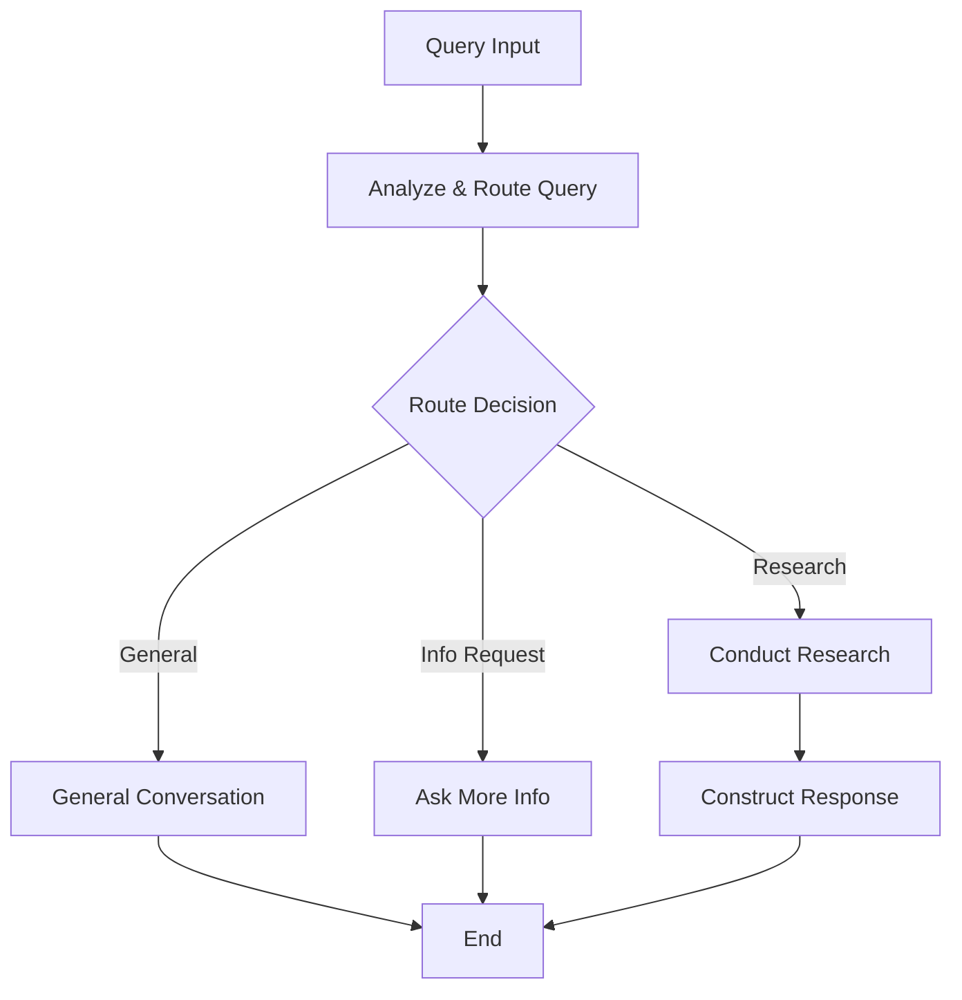

# 🤖 Agentic Python Backend

A sophisticated AI-powered news chatbot backend built with FastAPI, LangGraph, and advanced RAG (Retrieval-Augmented Generation) capabilities. This system processes news articles, creates embeddings, and provides intelligent conversational responses with real-time streaming.

## 🏗️ Architecture Overview

### Core Technologies

- **FastAPI**: Modern, fast web framework for building APIs
- **LangGraph**: Advanced agent orchestration and workflow management
- **LangChain**: LLM framework for building AI applications
- **Pinecone**: Vector database for semantic search
- **Google Gemini**: Large Language Model for responses
- **News-Please**: News article extraction and processing

### System Components

```
┌─────────────────┐    ┌──────────────────┐    ┌─────────────────┐
│   FastAPI App   │    │  Retrieval Agent │    │ Embedding Agent │
│                 │    │                  │    │                 │
│ • Chat Routes   │◄──►│ • Query Analysis │    │ • Article Extract│
│ • Article Routes│    │ • Research       │    │ • Embedding     │
│ • Health Check  │    │ • Response Build │    │ • Vector Store  │
└─────────────────┘    └──────────────────┘    └─────────────────┘
         │                       │                       │
         ▼                       ▼                       ▼
┌─────────────────┐    ┌──────────────────┐    ┌─────────────────┐
│   Pinecone DB   │    │  Scheduler       │    │  Background     │
│                 │    │                  │    │  Processing     │
│ • Vector Search │    │ • Auto Embedding │    │ • Article Tasks │
│ • Similarity    │    │ • Cron Jobs      │    │ • Vector Updates│
│ • Retrieval     │    │ • Status Monitor │    │ • Error Handling│
└─────────────────┘    └──────────────────┘    └─────────────────┘
```

## 🚀 Core Features

### 1. **Intelligent Chat System**

- **Real-time Streaming**: Server-Sent Events (SSE) for live responses
- **Context-Aware**: Maintains conversation history and context
- **Multi-Modal Routing**: Intelligent query analysis and routing
- **Citation System**: Provides source links and article references

### 2. **Advanced RAG Pipeline**

- **Semantic Search**: Vector-based document retrieval
- **Query Expansion**: Multi-query generation for comprehensive results
- **Document Filtering**: Relevance-based content filtering
- **Response Construction**: Context-aware answer generation

### 3. **News Processing Engine**

- **RSS Feed Processing**: Automated news article extraction
- **Content Embedding**: Vector representation of articles
- **Scheduled Updates**: Automated background processing
- **Category Classification**: News categorization system

### 4. **Agent Orchestration**

- **LangGraph Workflows**: Complex multi-step AI processes
- **Conditional Routing**: Dynamic workflow paths based on query type
- **Error Handling**: Robust error recovery and fallback mechanisms
- **Streaming Events**: Real-time progress updates

## 📊 Data Flows

### 1. Chat Query Flow

```
User Query → FastAPI → Query Analysis → Route Decision →
Research/General/Info Request → Vector Search → Document Retrieval →
Response Construction → Stream to Client
```

### 2. Article Embedding Flow

```
RSS Feed → Article Extraction → Content Processing → Embedding Generation →
Vector Storage → Pinecone Index → Search Ready
```

### 3. Streaming Response Flow

```
Query Input → Agent Graph → Real-time Chunks → Stream Live to Client →
Complete Response → Citations → Stream Complete Event
```

## 🛠️ API Endpoints

### Chat Endpoints

#### **POST** `/chat/stream`

Real-time streaming chat with SSE

```json
{
  "query": "What's the latest news about AI?",
  "chat_history": [
    { "role": "user", "content": "Hello" },
    { "role": "assistant", "content": "Hi! How can I help?" }
  ],
  "category": "news"
}
```

**Response**: Server-Sent Events stream

```
data: {"event": "start", "data": {"message": "Starting..."}}
data: {"event": "response_chunk", "data": {"chunk": "Based on"}}
data: {"event": "response_complete", "data": {"response": "..."}}
data: {"event": "complete", "data": {"citations": [...]}}
```

#### **POST** `/chat/query`

Non-streaming chat query

```json
{
  "query": "Tell me about recent developments",
  "chat_history": [],
  "category": "other"
}
```

**Response**:

```json
{
  "response": "Based on recent articles...",
  "citations": [
    {
      "url": "https://example.com/article",
      "source": "example.com",
      "authors": ["John Doe"],
      "published_date": "2024-01-15",
      "article_id": "art_12345"
    }
  ]
}
```

### Article Endpoints

#### **POST** `/articles/embed`

Process and embed news articles

```json
{
  "articles": [
    {
      "url": "https://rss.example.com/feed.xml",
      "num_articles": 10,
      "category": "technology"
    }
  ],
  "run_in_background": true
}
```

### System Endpoints

#### **GET** `/health`

Service health check

```json
{
  "status": "healthy"
}
```

#### **GET** `/scheduler/status`

Background scheduler status

```json
{
  "status": "running",
  "next_run": "2024-01-15T12:00:00Z"
}
```

## 🧠 Agent Architecture

### Retrieval Agent Graph



### Node Functions

#### **1. Analyze & Route Query**

- **Purpose**: Determine query type and routing decision
- **Input**: User query, chat history
- **Output**: Routing decision (general/research/info_request)
- **Logic**: LLM-based classification with reasoning

#### **2. Conduct Research**

- **Purpose**: Retrieve relevant documents and information
- **Process**:
  - Generate multiple search queries
  - Vector search in Pinecone
  - Filter and rank results
  - Extract relevant content

#### **3. Construct Response**

- **Purpose**: Build comprehensive answer with citations
- **Process**:
  - Synthesize retrieved information
  - Generate coherent response
  - Add citation references
  - Format for streaming

#### **4. General Conversation**

- **Purpose**: Handle non-research queries
- **Process**: Direct LLM response for general questions

#### **5. Ask More Info**

- **Purpose**: Request clarification for ambiguous queries
- **Process**: Generate follow-up questions

## 🗄️ Vector Database Strategy

### Pinecone Configuration

- **Index Type**: Dense vector index
- **Dimensions**: 1024 (Jina embedding dimensions)
- **Metric**: Cosine similarity
- **Namespace**: Category-based organization

### Embedding Process

```python
# Article Processing Pipeline
RSS Feed → Article Extraction → Content Cleaning →
Chunking → Embedding Generation → Vector Storage
```

### Search Strategy

- **Multi-Query Generation**: Create multiple search variations
- **Relevance Filtering**: Score and filter results
- **Context Window**: Optimize for LLM context limits

## ⚙️ Configuration

### Environment Variables

```bash
# API Keys
PINECONE_API_KEY=your_pinecone_key
JINA_API_KEY=your_jina_key
GOOGLE_API_KEY=your_google_key

# Application Settings
APP_NAME=Agentic API
DEBUG=true
ALLOWED_ORIGINS=http://localhost:8001,https://your-domain.com

# Scheduler Settings
ENABLE_SCHEDULER=true
EMBEDDING_CRON_HOURS=12
```

### Dependencies

```toml
# Core Framework
fastapi = ">=0.116.1,<0.117.0"
uvicorn = ">=0.35.0,<0.36.0"

# AI/ML Libraries
langchain = ">=0.3.27,<0.4.0"
langgraph = ">=0.6.7,<0.7.0"
langchain-google-genai = ">=2.1.12,<3.0.0"

# Vector Database
langchain-pinecone = ">=0.2.12,<0.3.0"

# News Processing
news-please = ">=1.6.15,<2.0.0"
feedparser = ">=6.0.12,<7.0.0"

# Utilities
pydantic = ">=2.11.9,<3.0.0"
apscheduler = ">=3.11.0,<4.0.0"
```

## 🚀 Setup & Installation

### Prerequisites

- Python 3.12+
- Poetry (package manager)
- Pinecone account
- Google AI API key

### Installation

```bash
# Clone repository
git clone <repository-url>
cd agentic-py

# Install dependencies
poetry install

# Activate virtual environment
poetry shell

# Set up environment variables
cp .env.example .env
# Edit .env with your API keys

# Run the application
poetry run uvicorn app.main:app --host 0.0.0.0 --port 8000 --reload
```

### Development Setup

```bash
# Install development dependencies
poetry install --with dev

# Run with hot reload
poetry run uvicorn app.main:app --reload --log-level debug

# Run tests
poetry run pytest

# Format code
poetry run black .
poetry run isort .
```

## 🔄 Background Processing

### Scheduler Service

- **Purpose**: Automated news processing and embedding
- **Frequency**: Configurable cron schedule (default: every 12 hours)
- **Tasks**: RSS feed processing, article embedding, vector updates
- **Monitoring**: Status endpoint for health checks

### Background Tasks

- **Article Embedding**: Process new articles in background
- **Vector Updates**: Update Pinecone index with new embeddings
